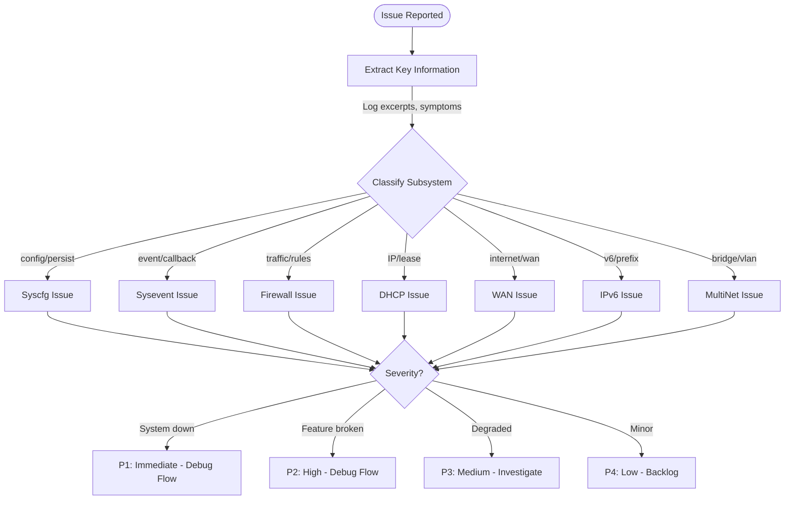
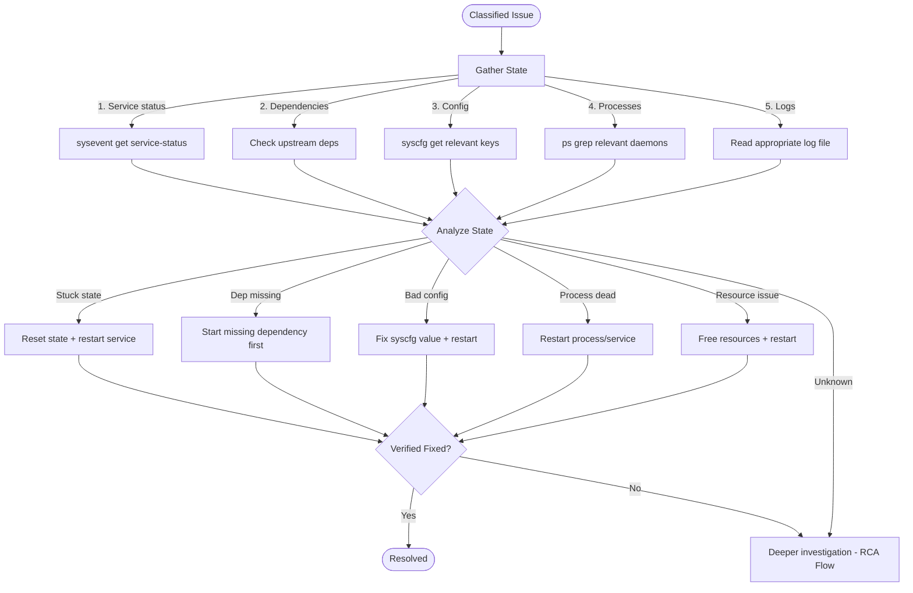
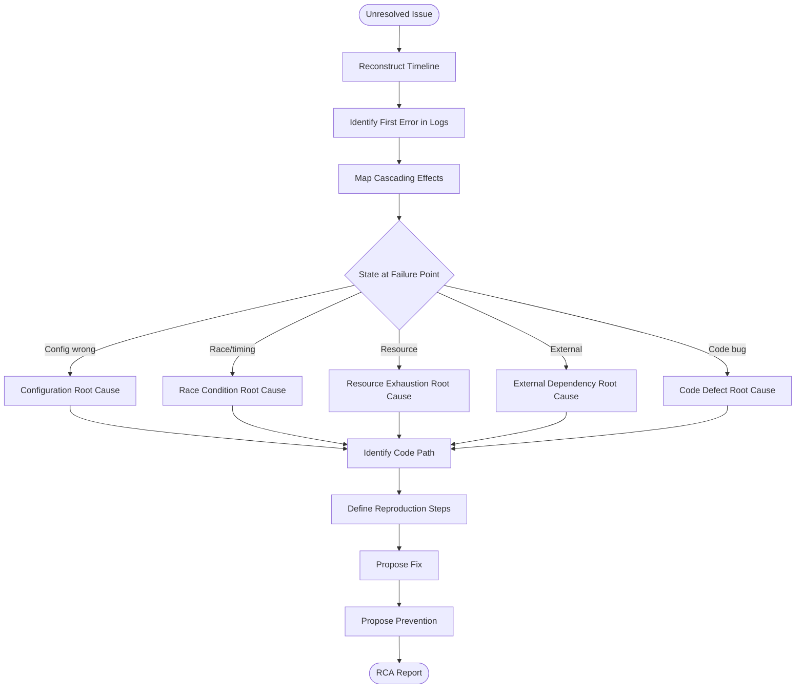

# AI Workflows

## Workflow 1: Issue Triage Flow



## Workflow 2: Debug Flow



## Workflow 3: RCA Flow



## Workflow 4: Service Health Check

```
INPUT: Service name to verify

SEQUENCE:
1. Check service status
   → sysevent get <service>-status
   → Expected: "started"
   → If "starting"/"stopping" for >30s → STUCK (see recovery)
   → If "stopped" when expected running → START NEEDED
   → If "error" → CHECK LOGS

2. Check dependent process
   → Map: service_dhcp→dnsmasq, service_wan→udhcpc, service_ipv6→dibbler
   → ps | grep <daemon>
   → If missing: service must restart it

3. Check functional behavior
   → DHCP: nmap --script broadcast-dhcp-discover on LAN
   → WAN: ping -c 1 -I erouter0 8.8.8.8
   → Firewall: iptables -L | wc -l (should be > 50)
   → DNS: nslookup google.com 127.0.0.1

4. Check configuration consistency
   → Compare syscfg values with runtime state
   → Example: syscfg get lan_ipaddr vs ifconfig brlan0

OUTPUT: Health status (healthy/degraded/down) + specific findings
```

## Workflow 5: Configuration Audit

```
INPUT: Optional specific subsystem to audit

SEQUENCE:
1. Dump full configuration
   → syscfg show > /tmp/config_audit.txt

2. Validate mandatory keys exist
   → REQUIRED_KEYS = [lan_ipaddr, lan_netmask, wan_proto, dhcp_start, 
                       dhcp_end, firewall_level, hostname]
   → For each: verify non-empty and syntactically valid

3. Validate cross-key consistency
   → dhcp_start and dhcp_end in same subnet as lan_ipaddr/lan_netmask
   → wan_proto matches expected values (dhcp|static|pppoe)
   → StaticRoute entries have valid IP format
   → PortForward entries have valid port ranges (1-65535)

4. Check for corruption indicators
   → Keys with non-printable characters
   → Values exceeding 256 bytes (unusual)
   → Duplicate keys (shouldn't exist in hash table)
   → Keys not in system_defaults AND not in any code (orphaned)

5. Compare with defaults
   → Load /etc/utopia/system_defaults
   → Flag any key deviating from default (informational)

OUTPUT: Audit report with findings categorized as:
  - CRITICAL: Mandatory key missing/invalid
  - WARNING: Inconsistent cross-references
  - INFO: Non-default values (expected for configured device)
```

## Decision Trees

### Decision Tree: "No Internet" Triage

```
Q: Does WAN interface have an IP?
   → sysevent get current_wan_ipaddr
   │
   ├── EMPTY: WAN IP not acquired
   │   Q: Is WAN interface UP?
   │   │  → ifconfig erouter0
   │   ├── DOWN: Interface not up
   │   │   → sysevent set wan-start
   │   └── UP: Interface up, no IP
   │       Q: Is DHCP client running?
   │       │  → ps | grep udhcpc
   │       ├── NO: Start DHCP client
   │       │   → sysevent set wan-start
   │       └── YES: DHCP client running
   │           → Problem is upstream (ISP/cable/physical)
   │           → Check: cat /sys/class/net/erouter0/carrier
   │
   └── HAS IP: WAN has address
       Q: Can ping gateway?
       │  → ping -c 1 $(sysevent get default_router)
       ├── NO: Gateway unreachable
       │   Q: Is default route set?
       │   │  → ip route | grep default
       │   ├── NO: Route missing
       │   │   → sysevent set wan-restart (will re-add route)
       │   └── YES: Route exists, gateway unreachable
       │       → ARP issue or gateway down
       │
       └── YES: Gateway reachable
           Q: Can ping external (8.8.8.8)?
           ├── NO: NAT/firewall blocking
           │   → iptables -L FORWARD -n -v | grep REJECT
           │   → sysevent set firewall-restart
           └── YES: Ping works
               Q: DNS working?
               │  → nslookup google.com
               ├── NO: DNS issue
               │   → cat /etc/resolv.conf
               │   → sysevent set dhcp_server-restart
               └── YES: All working
                   → Issue is client-specific, not Utopia
```

### Decision Tree: "Service Not Starting"

```
Q: What does service-status show?
│  → sysevent get <service>-status
│
├── "starting" (stuck)
│   → Previous start didn't complete
│   → FIX: sysevent set <service>-status stopped
│          sysevent set <service>-start
│
├── "stopping" (stuck)
│   → Previous stop didn't complete
│   → FIX: kill remaining process, then:
│          sysevent set <service>-status stopped
│          sysevent set <service>-start
│
├── "error"
│   → Service tried to start and failed
│   → CHECK: logs for specific error
│   → COMMON: port conflict, missing config, dependency not ready
│
├── "stopped" (won't start)
│   → Start event not reaching service
│   → CHECK: Is callback registered? 
│            sysevent get xsm_<service>_async_id_start
│   → If empty: service not registered → re-register or restart syseventd
│
└── (empty/not set)
    → Service never initialized
    → CHECK: Is service in Makefile.am SUBDIRS?
    → CHECK: Was it conditionally compiled out?
```
